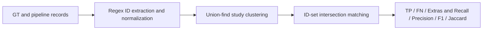

# Benchmark 1 - Study Detection: Results and Discussion

This document interprets the results of Benchmark 1 in formal, thesis-ready
prose. All figures are reproduced verbatim from the machine-generated artifacts
in this folder ([`benchmark_1_results.json`](benchmark_1_results.json),
[`benchmark_1_results.md`](benchmark_1_results.md), and the per-model
`*_matches.json` files); no values are estimated or introduced here. The
underlying procedure is defined in
[`../../methodology.md`](../../methodology.md).

## 1. Objective

Benchmark 1 quantifies how completely and how precisely the automated extraction
and classification pipeline reproduces the clinical-study set that was curated
manually for the ground truth (GT,
[`../../../Test_Datasets/test_dataset_benchmarking_numbers.json`](../../../Test_Datasets/test_dataset_benchmarking_numbers.json)).
Formally, the research question is: *given a list of Digital Therapeutics (DTx),
to what extent does the pipeline recover the same studies that a human analyst
identified manually, and how many additional studies does it surface?* The task
is framed as a record-linkage problem (deciding when an automatically extracted
record and a curated record denote the same real study) followed by an
information-retrieval evaluation (recall, precision, F1).

## 2. Materials

Two study collections are compared per DTx:

- **Ground truth.** 96 manually curated studies spanning 26 DTx.
- **Pipeline output.** The studies discovered automatically by Phase 2 and
  surfaced through the Phase 3 combined outputs of three models:
  [`gpt-4o`](../../../Phase_3_Evidence_Analysis/gpt-4o/Website_Search_ON/phase3_combined.json),
  [`gemini-3.1-pro-preview`](../../../Phase_3_Evidence_Analysis/gemini-3.1-pro-preview/Website_Search_ON/phase3_combined.json),
  and
  [`claude-sonnet-4-6`](../../../Phase_3_Evidence_Analysis/claude-sonnet-4-6/Website_Search_ON/phase3_combined.json).

A methodological point is essential for interpretation: the evidence candidates
were extracted and classified **once**, by the Phase 2 pipeline using gpt-4o with
Website Search / Browser Use enabled (the [`../../../evidence`](../../../evidence)
folder). The three Phase 3 files then analyzed that *same* evidence set. For a
study-count benchmark the Phase 3 files therefore serve only as carriers of the
per-study identifiers (`trial_registration_id`, `sources_publications`).
Consequently, Benchmark 1 characterizes the **Phase 2 extraction stage**, and the
three models function as a determinism control rather than as three independent
detectors.

## 3. Methods (summary)

Each record's identifier set is extracted deterministically by regular
expressions over its `trial_registration_id` and every URL in
`sources_publications`, normalizing public identifiers (ClinicalTrials.gov NCT,
DRKS, ISRCTN, EudraCT, PubMed PMID, PubMed Central PMC, and DOI). Records sharing
at least one identifier are merged into a single **study cluster** using a
union-find (connected-components) procedure, so that a registered protocol and
its later publication are counted once. A GT study and a pipeline study are
declared identical when their identifier sets intersect. Results are reported in
two scopes: the **full GT** (all 26 DTx) and the **covered subset** (only the 19
DTx for which the pipeline returned at least one verified study). The complete
specification, including
formulas and the rationale for deterministic rather than learned matching, is
given in [`../../methodology.md`](../../methodology.md).

## 4. Results

### 4.1 Overall detection performance

The pipeline produced 120 study rows, which collapsed into 109 distinct study
clusters after identifier-based de-duplication; this 120-to-109 reduction is the
direct effect of merging protocol and publication records of the same study.
Detection outcomes are summarized below.

**Full-GT scope (all 26 DTx):**

| Model | Pipeline studies | TP (matched) | FN (missed) | Extras | Recall | Precision* | F1 |
|---|--:|--:|--:|--:|--:|--:|--:|
| gpt-4o | 109 | 61 | 35 | 32 | 63.5% | 65.6% | 64.6% |
| gemini-3.1-pro-preview | 109 | 61 | 35 | 32 | 63.5% | 65.6% | 64.6% |
| claude-sonnet-4-6 | 109 | 61 | 35 | 32 | 63.5% | 65.6% | 64.6% |

**Covered-subset scope (19 DTx with at least one verified study):**

| Model | TP (matched) | FN (missed) | Extras | Recall | Precision* | F1 |
|---|--:|--:|--:|--:|--:|--:|
| gpt-4o | 61 | 18 | 32 | 77.2% | 65.6% | 70.9% |
| gemini-3.1-pro-preview | 61 | 18 | 32 | 77.2% | 65.6% | 70.9% |
| claude-sonnet-4-6 | 61 | 18 | 32 | 77.2% | 65.6% | 70.9% |

\* Precision is reported as a corroboration rate (the share of pipeline studies
confirmed by the GT) and constitutes a lower bound on true precision until the
Extras are adjudicated (Section 4.6).

The pipeline recovered 61 of the 96 curated studies. Across the full GT this
yields a recall of 63.5%; restricted to the DTx for which the pipeline verified
at least one study, recall rises to 77.2%. The constancy of precision (65.6%)
between the two scopes follows from the design: every matched study and every
extra necessarily belongs to a DTx that yielded verified evidence, so only the
false-negative count (and hence recall and F1) changes between scopes.

### 4.2 Determinism across models

All three models yielded identical counts (109 clusters; TP 61, FN 35, Extras
32). This is the expected outcome and serves as an internal validity check:
because the three Phase 3 runs analyze the same Phase 2 evidence, the set of
identifiers they expose is invariant, and the deterministic linkage procedure
maps identical inputs to identical outputs. The result confirms two things:
(i) the identifier extraction and clustering are stable and reproducible, and
(ii) the numbers reported here reflect the extraction pipeline itself, not any
particular analysis model.

### 4.3 Coverage gap

The difference between the full-GT recall (63.5%) and the covered-subset recall
(77.2%) is attributable almost entirely to **DTx for which no evidence was
found**. For seven GT DTx - neolexon Aphasia, Selfapy's online course for chronic
pain, Selfapy's online course for panic disorder, Beats Medical Parkinson's, Feel
DTx, Embr Wave 2, and Sword Thrive - the pipeline ran the full evidence search
(each has a populated `candidates/` and `rejected/` folder under
[`../../../evidence`](../../../evidence)) but **verified zero studies**;
consequently they have no rows in the Phase 3 output. These seven DTx account for
17 of the 96 GT studies. Because the pipeline surfaced no verified records for
them, all 17 studies are unavoidable false negatives that depress the full-GT
recall - not because the DTx were skipped, but because the search returned
nothing that passed verification. Of the 35 total misses, 17 (48.6%) therefore
originate from this zero-evidence outcome rather than from linkage error; the
remaining 18 are genuine extraction or matching misses within DTx that did yield
verified evidence (Section 4.5).

### 4.4 Per-DTx behaviour

Detection quality is highly heterogeneous across DTx, as captured by the per-DTx
Jaccard overlap of study sets. Several covered DTx achieved complete agreement
with the GT (Jaccard 100%): Orthopy for knee injuries (6/6), Caterna Vision
Therapy (2/2), Rehappy (1/1), Companion Shoulder (1/1), and Sword Bloom (1/1).
At the opposite end, three covered DTx show low overlap despite being processed:
Vivira (Jaccard 16.7%; 2 matched, 12 pipeline clusters), Kaia back pain (30.0%;
3 of 10 GT studies matched), and deprexis (40.4%; 19 of 20 GT studies matched but
46 pipeline clusters). The Vivira and deprexis cases are driven by a large number
of additional pipeline studies (Extras), whereas the Kaia case is driven by
missed GT studies (false negatives). These two failure modes are examined
separately below.

### 4.5 Missed studies (false negatives)

Eighteen GT studies belonging to covered DTx were not recovered. They concentrate
in a small number of DTx, most prominently Kaia back pain (7 misses) and somnio
(3 misses), with single or double misses for Cara Care for IBS, Companion
Patella, HelloBetter Chronic Pain, HelloBetter Diabetes, deprexis, Re.flex, and
RelieVRx. Inspection of the missed records in
[`gpt-4o_matches.json`](gpt-4o_matches.json) reveals two recurring patterns.
First, several missed GT studies carry **no extractable identifier** (for
example, a Cara Care RWE entry and a deprexis RWE entry list only non-identifying
URLs); such records cannot be matched under an identifier-only linkage and are
counted conservatively as misses. Second, a substantial share of the Kaia misses
are **real-world evidence (RWE)** publications or registry entries (for example
PMIDs 29203460, 29875088, 32547175, 34751664 and registrations NCT04290078,
NCT04411108) that the Phase 2 candidate search did not surface. The pattern
indicates that misses are driven less by linkage failure than by gaps in the
upstream candidate retrieval, particularly for RWE.

### 4.6 Extras requiring adjudication

The pipeline surfaced 32 study clusters with no GT counterpart. Following the
adjudication-oriented framing adopted in this thesis, these are reported as
**Extras** rather than as hard false positives, because the manually curated GT is
not guaranteed to be exhaustive: an extra may be either a genuine study the
manual curation omitted or a true over-extraction. The Extras are not distributed
uniformly; they are dominated by deprexis (19 of 32), followed by Vivira/ViViRA
(8), with smaller contributions from optimune (2), Somryst (2), and HelloBetter
Chronische Schmerzen (1). The deprexis concentration is notable: the pipeline
identified 46 clusters against 20 GT studies for this single DTx, suggesting that
either the manual GT for deprexis is incomplete or the broad search for a
well-studied product retrieved related-but-distinct trials. Each extra is
enumerated with its identifier, attributed DTx, evidence type, and source URL in
the report's adjudication table and in the per-model match files, enabling manual
review. Until that adjudication is performed, the reported precision of 65.6%
should be read strictly as a lower bound.

## 5. Discussion

Three findings stand out. First, on the DTx for which it verified at least one
study, the pipeline demonstrates strong detection capability, recovering 77.2% of
curated studies with an F1 of 70.9%. This indicates that the combination of
multi-registry search, PubMed retrieval, and browser-assisted website search is
effective once a DTx yields verifiable evidence. Second, the principal bottleneck
for end-to-end performance is the set of DTx for which **no evidence was
verified**, not linkage: 17 of 35 misses arise from seven DTx that the pipeline
processed but for which it verified zero studies. The single largest contributor
is Sword Thrive, whose ten GT studies are all missed; this aligns with the
previously documented limitation that a generic product token (for example
"Sword") must be qualified to the company entity ("Sword Health") to retrieve
relevant evidence, otherwise the candidate search is either empty or overwhelmed
by irrelevant hits that are subsequently rejected at verification. Third,
the Extras are highly localized, with deprexis alone accounting for 19 of 32;
this is more consistent with an incomplete manual GT for an extensively studied
product than with systematic over-extraction across the catalogue. The strong
recall on a study such as deprexis (19 of 20 GT studies matched) reinforces this
interpretation.

The cross-model invariance of the results is itself a useful methodological
outcome: it confirms that study detection is a property of Phase 2 and that the
choice of Phase 3 analysis model does not affect which studies are found, which
cleanly separates *detection* (Benchmark 1) from *analysis quality* (the planned
Benchmark 2).

## 6. Threats to validity and limitations

- **Ground-truth completeness.** Recall and precision are measured against a
  manually curated reference that may be neither exhaustive nor error-free.
  Extras and some false negatives may reflect GT gaps rather than pipeline
  errors; precision is therefore reported as a lower bound pending adjudication.
- **Identifier-only matching.** Studies whose sources contain no extractable
  identifier (company or landing-page URLs without an embedded ID) cannot be
  linked and are counted as misses, which conservatively understates recall. A
  fuzzy title/DOI matcher is a possible future extension for adjudicating these
  edge cases but was deliberately excluded from the primary metric to preserve
  determinism.
- **Single shared evidence set.** Because all three models analyze one Phase 2
  extraction, Benchmark 1 cannot attribute detection differences to the analysis
  model; it evaluates the extraction stage only.
- **Manual crosswalk.** Per-DTx attribution relies on a hand-built crosswalk
  ([`../dtx_crosswalk.json`](../dtx_crosswalk.json)) mapping GT names to pipeline
  slugs; the headline matching itself is identifier-based and independent of this
  mapping, but per-DTx coverage figures depend on its correctness.

## 7. Conclusion

The automated pipeline reproduces the manually curated study set with a recall of
63.5% over all DTx and 77.2% over the DTx for which it verified at least one
study, at a corroboration-based precision of 65.6% and an F1 of up to 70.9%.
Performance is limited chiefly by the DTx for which the search verified no
evidence at all (seven DTx, 17 GT studies, nothing to evaluate) and by gaps in
RWE candidate retrieval, while a small number of products (notably deprexis)
generate most of the unmatched Extras. The immediate next steps are manual adjudication of the 32 Extras to
convert the lower-bound precision into a definitive value, and the execution of
Benchmark 2 to evaluate the quality of the extracted analysis fields.
