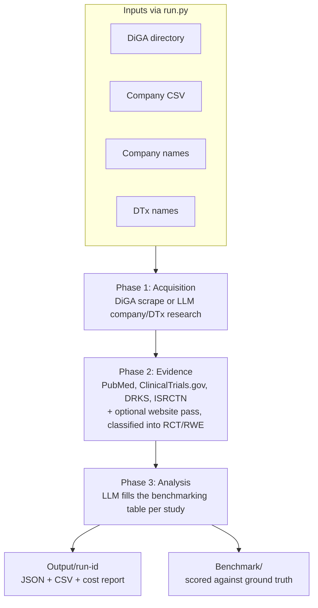

# DTx Evidence Pipeline

A three-phase pipeline that builds a structured, benchmarked dataset of Digital
Therapeutics (DTx) and their clinical evidence:

1. **Phase 1 - Acquisition.** Scrape the German DiGA directory, or LLM-research
   companies/DTx for the general (non-German) path.
2. **Phase 2 - Evidence.** Find candidate studies (PubMed, ClinicalTrials.gov,
   DRKS, ISRCTN, and an optional website pass) and classify verified RCT/RWE.
3. **Phase 3 - Analysis.** Use an LLM to fill a structured benchmarking table
   from each verified study's raw content.

## Pipeline architecture



## Install

Requires Python 3.10+.

```bash
python -m venv venv && source venv/bin/activate
pip install -r requirements.txt
playwright install chromium   # browser used for scraping (Phase 1 / website pass)
cp .env.example .env          # then fill in your provider keys (LLM_PROVIDER, etc.)
```

## Usage

The easiest way to run the whole pipeline is the input-driven orchestrator. Edit
[`Input/job.yaml`](Input/job.yaml), then:

```bash
python run.py                 # run the active job
python run.py --dry-run       # preview the plan without spending LLM calls
```

It supports four input modes - the full German DiGA directory, a CSV of
companies, one or more companies (with/without a DiGA), and one or more DTx
(with/without a DiGA) - and writes a self-contained, cost-tracked result folder
per run under `Output/<run-id>/` (the run's DTx/company JSON, the full evidence
trees, the Phase 3 analysis, and the cost report).

> Web search note: the general/US path (CSV and non-DiGA company/DTx modes)
> needs a web-search-capable provider (`LLM_PROVIDER=openai`/`gemini`/`anthropic`).
> Azure OpenAI cannot web-search through this pipeline, so those runs would find
> nothing on Azure. German/DiGA modes are scraping-based and work on any provider.

**See [`USAGE.md`](USAGE.md) for the full guide** (modes, job options, single vs.
list inputs, outputs, cost reporting, and the web search/provider details).

### Lower-level commands

The individual phases are also available directly via `python main.py <command>`
(`scrape-dtx`, `scrape-usa`, `find-evidence`, `analyze-evidence`, ...); `run.py`
simply sequences these for each input mode. Run `python main.py --help` for the
full list.

## Repository layout

```
run.py            # input-driven orchestrator (the main entry point)
main.py           # lower-level per-phase CLI commands
scrapers/         # Phase 1 + Phase 2 scrapers (DiGA, USA, evidence sources)
  evidence/       #   PubMed, ClinicalTrials.gov, DRKS, ISRCTN, website, Phase 3 analyzer
utils/            # shared helpers (LLM provider, metrics, verifier, converters)
config/           # per-country config (germany.json, usa.json)
data-format/      # schemas the pipeline loads at runtime + CSV input format
Input/            # job.yaml + templates + example company CSV
Output/           # per-run results (generated, git-ignored)
Test_Datasets/    # manually-curated ground truth for benchmarking
Benchmark/        # benchmark methodology, code, and results
```

## Benchmarks

Scientific benchmarks comparing the pipeline against manually-curated ground
truth live in [`Benchmark/`](Benchmark) (study-count and field-extraction
quality), with methodology, references, and reproducible code. The ground-truth
datasets are in [`Test_Datasets/`](Test_Datasets).
